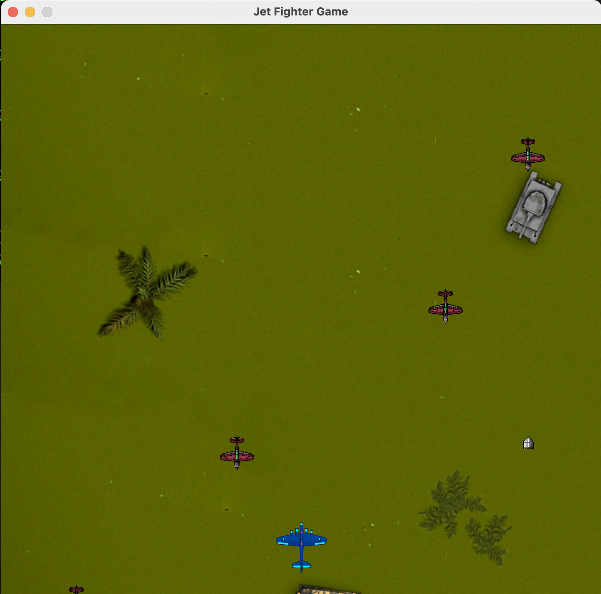

# Jet Fighter Game

Jet Fighter Game is a simple arcade-style game developed in Java using Swing. It offers an engaging experience where the player controls a jet fighter, dodges enemy bullets, and shoots down incoming enemy aircraft.

## Features

- **Player Control:** Control your jet fighter using the arrow keys to move left and right and the spacebar to shoot bullets.
- **Enemy Aircraft:** Enemy aircraft descend from the top of the screen. Dodge their bullets and destroy them to survive.
- **Scoring:** Earn points by shooting down enemy aircraft. The game ends when an enemy bullet or an enemy collides with your jet fighter.
- **Dynamic Gameplay:** The game dynamically generates enemy aircraft and their bullets to provide an increasingly challenging experience.

## Installation

1. Clone the repository:

   ```bash
   git clone https://github.com/your-username/jet-fighter-game.git
   ```

2. Navigate to the project directory:

   ```bash
   cd jet-fighter-game
   ```

3. Compile the Java files:

   ```bash
   javac JetFighterGame.java
   ```

4. Run the game:

   ```bash
   java JetFighterGame
   ```

## Gameplay

- Use the left and right arrow keys to move your jet fighter.
- Press the spacebar to shoot bullets and destroy enemy aircraft.
- Dodge enemy bullets to avoid getting hit.
- Earn points by shooting down enemy aircraft.

## Screenshots



## Contributing

Contributions are welcome! If you'd like to contribute to this project, please follow these steps:

1. Fork the repository.
2. Create a new branch (`git checkout -b feature-new-feature`).
3. Make your changes.
4. Commit your changes (`git commit -am 'Add new feature'`).
5. Push to the branch (`git push origin feature-new-feature`).
6. Create a new Pull Request.

## License

This project is licensed under the MIT License. See the [LICENSE](LICENSE) file for details.
